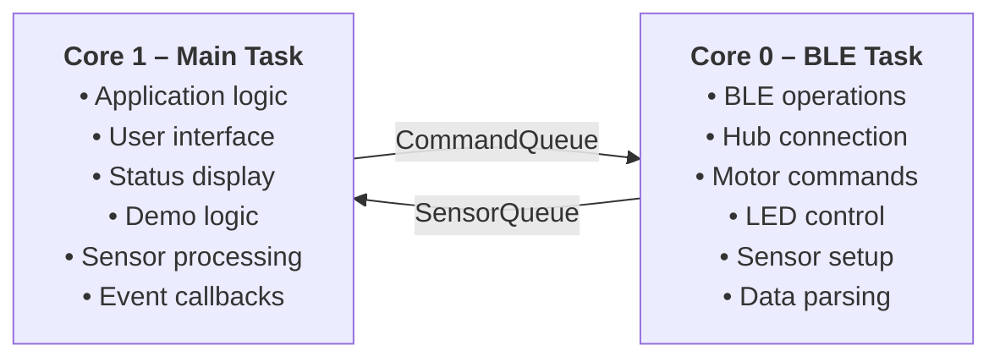
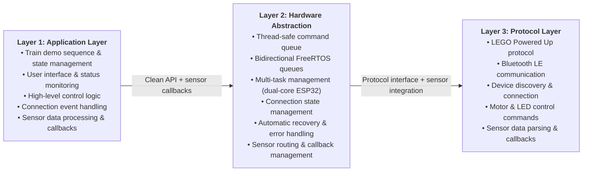
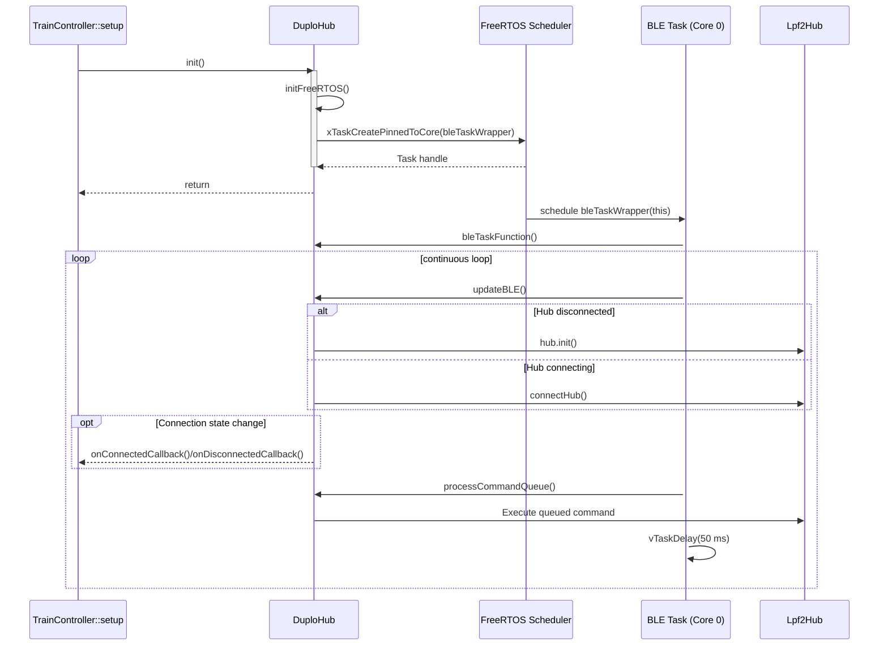

# DUPLO Train Controller System

**A professional, event-driven train control system for LEGO DUPLO, built on ESP32, FreeRTOS, and Bluetooth Low Energy (BLE).**

---

**Author:** Ralf Zühlsdorff  
**Copyright:** 2022-2025 Ralf Zühlsdorff

**Version:** 2.0.0  
**Last Updated:** July 2025  
**Compatibility:** ESP32, Arduino Framework, PlatformIO

**Disclaimer:** LEGO® and Duplo® are trademarks of the LEGO Group of companies which does not sponsor, authorize or endorse this project.

**License:** MIT License (see LICENSE file for details)

---


## 📋 Table of Contents

- [Project Overview](#project-overview)
- [System Architecture](#system-architecture)
- [Features](#features)
- [Hardware Requirements](#hardware-requirements)
- [Software Dependencies](#software-dependencies)
- [Installation](#installation)
- [Usage](#usage)
- [API Reference](#api-reference)
- [System Monitoring](#system-monitoring)
- [Troubleshooting](#troubleshooting)
- [Development](#development)
- [Contributing](#contributing)
- [License](#license)
- [Acknowledgments](#acknowledgments)
- [Architecture](ARCHITECTURE.md)
- [Changelog](CHANGELOG.md)

---

## 📖 Project Overview

This project implements a robust, multi-layered, event-driven train controller for LEGO DUPLO trains. It leverages:

- **ESP32 dual-core architecture** (FreeRTOS): BLE and application logic run on separate cores for maximum responsiveness.
- **Legoino library**: LEGO Powered Up protocol and device abstraction.
- **Thread-safe command and sensor queues**: Bidirectional, non-blocking communication between BLE and main application tasks.
- **Automatic connection management**: Self-healing BLE connections and error recovery.
- **Professional logging and monitoring**: Real-time status, error, and performance reporting.

For a detailed technical breakdown, see [ARCHITECTURE.md](ARCHITECTURE.md).

---
## Future Improvements

- Small Duplo Train Controller based on ESP32-S3 with integrated batterie management
- small Lithium Batterie
- Instead of Poti use of rotary encoder
- Function to record actions and play back (Buttons Rec, Play)
- small Duplo sized printed housing
- only 3 Buttons to control LED, sound and emergency stop
- Function to pair with train (store ID and use when connecting)


---
## 🏗️ System Architecture

### Multi-Task Processing with Bidirectional Communication




### Three-Layer Architecture



### duploHub.init() Bootstrapping Flow

The following sequence diagram visualizes how the application brings up the BLE infrastructure when `duploHub.init()` is called from `TrainController::setup()`.



---

## ✨ Features

- **Multi-Task BLE Management**: BLE operations run on a dedicated core, never blocking the main application.
- **Automatic Connection & Recovery**: Discovers, connects, and reconnects to DUPLO train hubs automatically.
- **Thread-Safe Commands**: Queue-based command system prevents race conditions.
- **Real-Time Control**: Low-latency motor speed and LED color control.
- **Sensor Integration**: Color, distance, and button sensors with callback support.
- **Professional Logging**: Detailed, component-specific log messages and system status monitoring.
- **Resource Management**: Proper FreeRTOS object lifecycle management.
- **Demo Mode**: Non-blocking demo sequence with visual feedback and safety features.

---

## 🔧 Hardware Requirements

### Primary Hardware

- **ESP32 Development Board** (ESP32-DevKitC or compatible)
- **LEGO DUPLO Train Hub** with motor connected to Port A
- **USB Cable** for programming and power

### Supported LEGO Hardware

- DUPLO Train Hub (Hub Type: `DUPLO_TRAIN_HUB`)
- DUPLO Train Motors (connected to Port A)
- Compatible with other Powered Up hubs (with minor modifications)

### Technical Specifications

- **Microcontroller**: ESP32 (dual-core, 240MHz)
- **Memory**: 520KB SRAM, 4MB Flash minimum
- **Connectivity**: Bluetooth 4.2 LE
- **Operating Voltage**: 3.3V
- **Power Consumption**: ~200mA during active operation

---

## 📦 Software Dependencies

### Platform

- **PlatformIO**: Development platform
- **ESP32 Arduino Framework**: Core ESP32 support
- **FreeRTOS**: Real-time operating system (included with ESP32)

### Libraries

- **Legoino**: LEGO Powered Up protocol implementation
- **NimBLE-Arduino**: Bluetooth Low Energy stack
- **Bounce2**: Button debouncing (part of Legoino dependencies)

### Library Versions

```ini
[env:esp32dev]
platform = espressif32
board = esp32dev
framework = arduino
lib_deps = 
    legoino/Legoino
    h2zero/NimBLE-Arduino
```

---

## 🚀 Installation

### 1. Environment Setup

```bash
# Install PlatformIO CLI
pip install platformio

# Clone the repository
git clone <repository-url>
cd DuploTrain
```

### 2. Project Build & Upload

```bash
# Build the project
pio run

# Upload to ESP32
pio run --target upload

# Open serial monitor
pio device monitor
```

### 3. Hardware Setup

1. Connect ESP32 to computer via USB
2. Power on your DUPLO train hub
3. Ensure motor is connected to Port A of the hub
4. Upload and run the code

---

## 📖 Usage

### Basic Operation

1. **Startup**: System automatically starts and begins scanning for DUPLO hubs
2. **Connection**: When hub is found, automatic connection is established
3. **Demo**: Once connected, the demo sequence begins automatically
4. **Monitoring**: Status information is displayed every 10 seconds

### Expected Serial Output

```text
TrainController: Starting up...
DuploHub: FreeRTOS objects initialized
DuploHub: BLE task started successfully
TrainController: Ready - BLE task running, waiting for hub connection...
BLE Task: Started successfully
BLE Task: Attempting initial connection to hub...
BLE Task: Connected to HUB
TrainController: Hub connected - initializing train demo!
TrainController: Starting train demo sequence...
TrainController Status - BLE Task: Running, Hub Connected: Yes, Demo Active: Yes
```

### Demo Sequence

The system runs a continuous demonstration:

1. **LED Green** → **LED Red** → **Motor Forward** → **Stop** → **Motor Backward** → **Stop** → **Repeat**
2. Each step lasts 1 second
3. Demo stops automatically if hub disconnects
4. Demo resumes automatically when reconnected

---

## 📚 API Reference

### DuploHub Class

#### Connection Management

```cpp
void startBLETask();                    // Start background BLE task
void stopBLETask();                     // Stop background BLE task
bool isConnected();                     // Check connection status (thread-safe)
bool isConnecting();                    // Check if connecting (thread-safe)
bool isDisconnected();                  // Check if disconnected (thread-safe)
bool isBLETaskRunning();                // Check BLE task status
```

#### Control Methods (Thread-Safe)

```cpp
void setMotorSpeed(int speed);          // Set motor speed (-100 to 100)
void stopMotor();                       // Stop motor immediately
void setLedColor(Color color);          // Set hub LED color
void setHubName(const char* name);      // Set hub name
```

#### Information Methods

```cpp
std::string getHubAddress();            // Get hub BLE address
std::string getHubName();               // Get hub name
byte getMotorPort();                    // Get configured motor port
void setMotorPort(byte port);           // Set motor port
```

#### Event Callbacks

```cpp
void setOnConnectedCallback(ConnectionCallback callback);     // Hub connected event
void setOnDisconnectedCallback(ConnectionCallback callback);  // Hub disconnected event
```

### DuploHubExtended Class (Sensor Support)

#### Sensor Callbacks

```cpp
typedef void (*ColorSensorCallback)(int color, byte port);
typedef void (*DistanceSensorCallback)(int distance, byte port);
typedef void (*ButtonCallback)(ButtonState state);

void setOnColorSensorCallback(ColorSensorCallback callback);      // Color sensor events
void setOnDistanceSensorCallback(DistanceSensorCallback callback);  // Distance sensor events
void setOnButtonCallback(ButtonCallback callback);                 // Button press events
```

#### Sensor Activation (Thread-Safe)

```cpp
void activateColorSensor(byte port);      // Activate color sensor on specified port
void activateDistanceSensor(byte port);   // Activate distance sensor on specified port
void activateButton();                    // Activate hub button monitoring
```

#### Example Usage

```cpp
// Color-based speed control
void onColorDetected(int color, byte port) {
    if (color == (byte)Color::RED) {
        duploHub.stopMotor();           // Emergency stop
    } else if (color == (byte)Color::GREEN) {
        duploHub.setMotorSpeed(50);     // Fast speed
    }
    duploHub.setLedColor((Color)color); // Match LED to detected color
}

// Setup
DuploHubExtended duploHub;
duploHub.setOnColorSensorCallback(onColorDetected);
duploHub.activateColorSensor((byte)PoweredUpHubPort::B);
```

### Available Colors

```cpp
BLACK, PINK, PURPLE, BLUE, LIGHTBLUE, CYAN, GREEN, YELLOW, ORANGE, RED, WHITE
```

### Motor Speed Range

- **Range**: -100 to 100
- **Positive**: Forward direction
- **Negative**: Backward direction
- **Zero**: Stop (equivalent to `stopMotor()`)

---

## 📊 System Monitoring

- **BLE Task**: Runs on Core 0, Priority 2
- **Main Loop**: Runs on Core 1, Priority 1
- **Connection Checks**: Every 1 second
- **Command Processing**: Every 50ms
- **Status Updates**: Every 10 seconds

### Status Information

The system provides comprehensive monitoring through serial output:

```text
TrainController Status - BLE Task: Running, Hub Connected: Yes, Demo Active: Yes
```

### Log Message Prefixes

- **`TrainController:`** - Main application messages
- **`BLE Task:`** - Background BLE task messages  
- **`DuploHub:`** - Hardware abstraction layer messages
- **`ERROR:`** - Critical system errors
- **`WARNING:`** - Non-critical issues

---

## 🔄 How Sensor Processing Works

When a DUPLO color sensor detects a color change, here's how it flows through the system:

```text
1. DUPLO Sensor    →  2. BLE Radio    →  3. ESP32 Core 0
   Detects RED        Transmits data     NimBLE + Lpf2Hub
4. Static Callback →  5. Sensor Queue  →  6. ESP32 Core 1
   Parse + Package     FreeRTOS Queue     Main Task Processing
7. User Callback   →  8. Motor Command →  9. BLE Command
   onColorDetected     stopMotor()         Back to DUPLO Hub
```

- **Total Time:** ~75ms from sensor detection to motor response

---

## 🎮 How Motor Control Works

When you call `duploHub.setMotorSpeed(50)`, here's how it flows through the system:

```text
1. Application     →  2. Thread-Safe   →  3. Command Queue
   setMotorSpeed(50)  Wrapper Function     FreeRTOS Queue
4. ESP32 Core 1    →  5. ESP32 Core 0   →  6. Protocol Format
   Main Task Queue    BLE Task Processing   Lpf2Hub + LEGO Protocol
7. BLE Transmission → 8. DUPLO Hub     →  9. Motor Hardware
   NimBLE + Radio      Protocol Parse     PWM Signal to Motor
```

- **Total Time:** ~60ms from function call to physical motor response

---

## 🔧 Troubleshooting

### Common Issues & Solutions

#### Connection Problems
- Ensure DUPLO hub is powered on and in pairing mode
- Check if hub is already connected to another device
- Reset hub by holding button for 10 seconds
- Move ESP32 closer to hub (within 5 meters)

#### Task Failures
- Check available heap memory: `ESP.getFreeHeap()`
- Reduce other running tasks
- Increase stack size in `startBLETask()`

#### Command Delays
- Check command queue status
- Verify BLE connection stability
- Reduce command frequency in application

### Debug Mode

Enable detailed debugging by adding to `platformio.ini`:

```ini
build_flags = -DCORE_DEBUG_LEVEL=4
monitor_filters = esp32_exception_decoder
```

---

## 🛠️ Development

### Project Structure

```text
DuploTrain/
├── include/
│   └── DuploHub.h              # Hardware abstraction layer header
├── src/
│   ├── TrainController.cpp     # Main application
│   └── DuploHub.cpp           # Hardware abstraction implementation  
├── lib/
│   ├── Legoino/               # LEGO Powered Up protocol library
│   ├── NimBLE-Arduino/        # Bluetooth LE stack
│   └── Bounce2/               # Button handling library
├── platformio.ini             # Build configuration
└── README.md                  # This file
```

### Adding New Features

#### New Train Commands
1. Add command type to `CommandType` enum in `DuploHub.h`
2. Add command data structure to `HubCommand` union
3. Implement thread-safe method in `DuploHub` class
4. Add processing logic to `processCommandQueue()`

#### New Hub Types
1. Modify hub type detection in BLE scanning
2. Add hub-specific command handling
3. Update motor port configurations if needed

### Code Style Guidelines
- Use clear, descriptive variable names
- Add comprehensive comments for complex logic
- Follow Arduino coding standards
- Use thread-safe practices for shared data
- Include error handling for all operations

---

## 🤝 Contributing

### Development Process
1. Fork the repository
2. Create feature branch (`git checkout -b feature/new-feature`)
3. Follow code style guidelines
4. Add comprehensive comments
5. Test thoroughly on hardware
6. Submit pull request with detailed description

### Testing Checklist
- [ ] Builds without warnings
- [ ] Connects to DUPLO hub successfully
- [ ] Motor control works in both directions
- [ ] LED colors change correctly
- [ ] Reconnection works after power cycle
- [ ] No memory leaks during long operation
- [ ] Task monitoring shows healthy system

---

## 📄 License

MIT License - see LICENSE file for details

---

## 🙏 Acknowledgments

- **Cornelius Munz** - Legoino library creator
- **LEGO Group** - DUPLO and Powered Up hardware
- **Espressif** - ESP32 platform
- **Arduino Community** - Framework and libraries

---

**Version:** 2.0.0  
**Last Updated:** July 2025  
**Compatibility:** ESP32, Arduino Framework, PlatformIO
