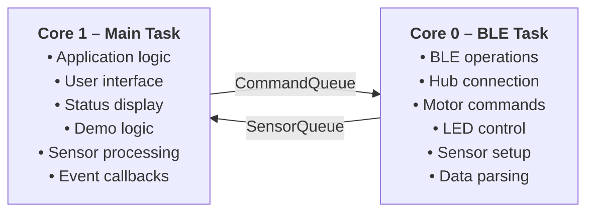
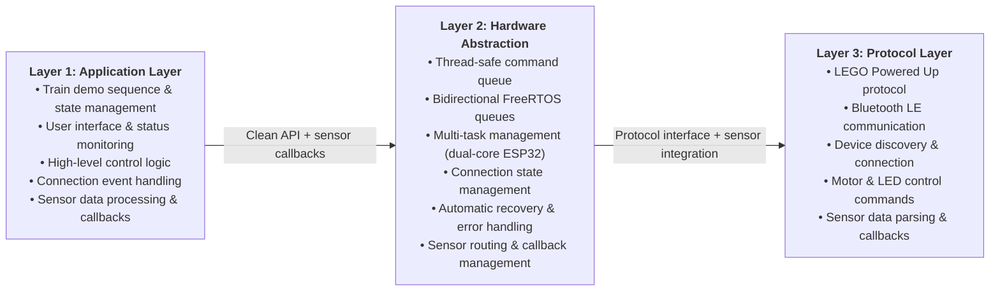
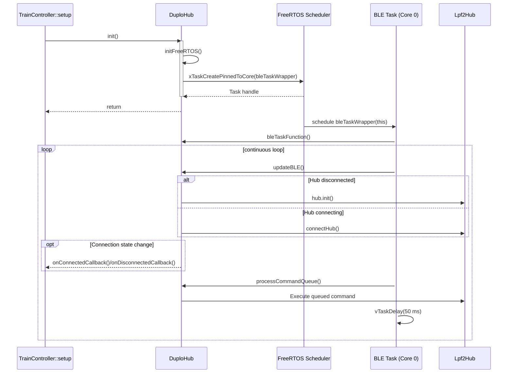
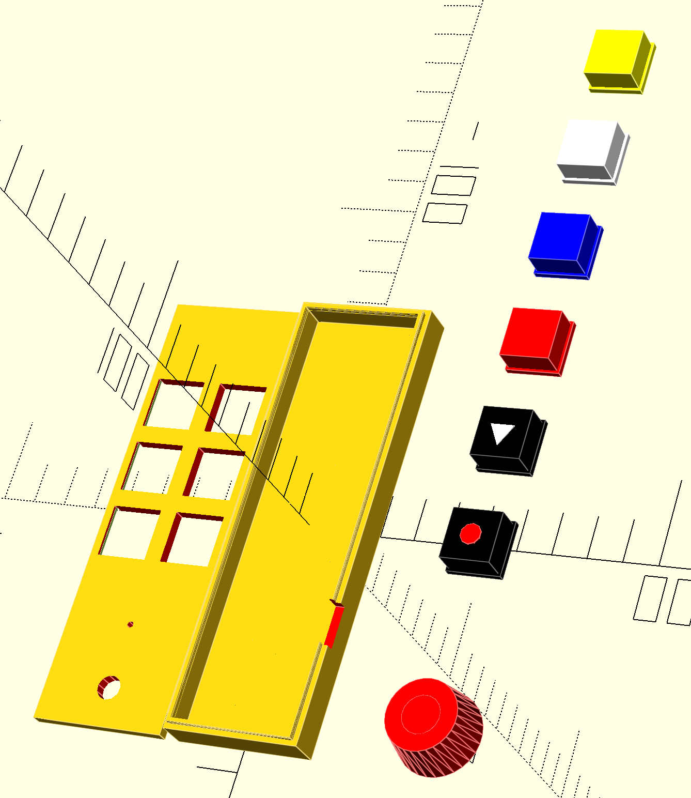

# DUPLO Train Remote Controller System

**A event-driven train remote control system for LEGO DUPLO, built on ESP32, FreeRTOS, and Bluetooth Low Energy (BLE).**

Copyright (c) 2022-2025 Ralf Zühlsdorff

This project is licensed under the terms of the MIT License. See the License section below for details.

----
## Table of Contents

- [DUPLO Train Remote Controller System](#duplo-train-remote-controller-system)
  - [Table of Contents](#table-of-contents)
  - [Project Overview](#project-overview)
  - [User Interface](#user-interface)
    - [Quick Start: Connecting a DUPLO Train](#quick-start-connecting-a-duplo-train)
    - [Button \& Encoder Actions](#button--encoder-actions)
    - [Optical Feedback (Controller RGB LED)](#optical-feedback-controller-rgb-led)
    - [Implemented Sensor Callbacks](#implemented-sensor-callbacks)
    - [Auto-Sleep \& Wake-Up](#auto-sleep--wake-up)
  - [Architecture Overview](#architecture-overview)
    - [Dual-Core Strategy](#dual-core-strategy)
    - [Future Improvements](#future-improvements)
  - [System Architecture](#system-architecture)
    - [Multi-Task Processing with Bidirectional Communication](#multi-task-processing-with-bidirectional-communication)
    - [Three-Layer Architecture](#three-layer-architecture)
    - [duploHub.init() Bootstrapping Flow](#duplohubinit-bootstrapping-flow)
  - [Features](#features)
  - [Hardware Requirements](#hardware-requirements)
    - [Primary Hardware](#primary-hardware)
    - [Supported LEGO Hardware](#supported-lego-hardware)
    - [Technical Specifications](#technical-specifications)
  - [Hardware Design](#hardware-design)
  - [Software Dependencies](#software-dependencies)
    - [Platform](#platform)
    - [Libraries](#libraries)
    - [Library Versions](#library-versions)
  - [Installation](#installation)
    - [1. Environment Setup](#1-environment-setup)
    - [2. Project Build \& Upload](#2-project-build--upload)
    - [3. Hardware Setup](#3-hardware-setup)
  - [Usage](#usage)
    - [Basic Operation](#basic-operation)
    - [Expected Serial Debug Output](#expected-serial-debug-output)
  - [API Reference](#api-reference)
    - [DuploHub Class](#duplohub-class)
      - [Connection Management](#connection-management)
      - [Control Methods (Thread-Safe)](#control-methods-thread-safe)
      - [Information Methods](#information-methods)
      - [Event Callbacks](#event-callbacks)
    - [DuploHubExtended Class (Sensor Support)](#duplohubextended-class-sensor-support)
      - [Sensor Callbacks](#sensor-callbacks)
      - [Sensor Activation (Thread-Safe)](#sensor-activation-thread-safe)
      - [Example Usage](#example-usage)
    - [Available Colors](#available-colors)
    - [Motor Speed Range](#motor-speed-range)
  - [System Monitoring](#system-monitoring)
    - [Status Information](#status-information)
    - [Log Message Prefixes](#log-message-prefixes)
  - [Troubleshooting](#troubleshooting)
    - [Common Issues \& Solutions](#common-issues--solutions)
      - [Connection Problems](#connection-problems)
      - [Task Failures](#task-failures)
      - [Command Delays](#command-delays)
    - [Debug Mode](#debug-mode)
  - [Development](#development)
    - [Project Structure](#project-structure)
    - [Adding New Features](#adding-new-features)
      - [New Train Commands](#new-train-commands)
      - [New Hub Types](#new-hub-types)
    - [Code Style Guidelines](#code-style-guidelines)
  - [Contributing](#contributing)
    - [Development Process](#development-process)
    - [Testing Checklist](#testing-checklist)
  - [Links](#links)
  - [License](#license)
  - [Acknowledgments](#acknowledgments)

---

## Project Overview

This project implements a robust, multi-layered, event-driven train controller for LEGO DUPLO trains. 

The system not only covers the firmware to controll the DUPLO train but also the required hardware and the OpenSCAD files for the case of the handheld controller.

I used a Tenstar Super Mini ESP32-S3 FH4R2 controller (yes, it is totally overkill for this application) because it provides onboard functionality as a RGB LED (used for user feedback) and a charging controller for a 3.7V Lithium battery. This onboard functionality reduced the required external components for the handheld controller to only 6 SMD switches, a rotary encoder and a few SMD resistors plus 1 capacitor.

The firmware builds on top of the open-source [Legoino](https://github.com/corneliusmunz/legoino) library created by Cornelius Munz, reusing its Powered Up protocol support while adding a hardened hardware abstraction tailored to ESP32 dual-core devices. Using both cores to implement the app signifficantly increased the overall reliability.

Key pillars of the solution include:

- **ESP32 dual-core architecture** (FreeRTOS): BLE communication runs independently from application logic for deterministic responsiveness.
- **Legoino-powered protocol stack**: Proven LEGO Powered Up discovery, device activation, and message parsing.
- **Thread-safe command and sensor queues**: Bidirectional, non-blocking communication between BLE and main application tasks.
- **Automatic connection management**: Self-healing BLE connections with exponential backoff recovery.
- **Enhanced logging and monitoring**: Real-time status, error, and performance reporting.
- **Deep Sleep and Wakeup**: In case no user interactions have been detected for more than 5 minutes the device goes to sleep and can be waked up by pressing the encoder button.

The high-level structure is summarised below; a deeper dive is available in [ARCHITECTURE.md](ARCHITECTURE.md).


## User Interface

THe handheld DUPLO train controller has 6 switches and a rotary encoder to send BLE commands to the DUPLO train hub. User feedback is provided through the onboard RGB LED of the ESP32-S3 controller.

### Quick Start: Connecting a DUPLO Train
- Power on the controller (ESP32) and the DUPLO Train Hub. 
- The DUPLO train will show a **white** blinking front light.
- The RGB LED of the controller turns to **yellow**.
- The controller immediately begins scanning for an active duplo train.
- Once internal initializatioon of the controller is completed the RBB LED turns to **green**. 
- If connected the DUPLO train will show a solid **blue** front light.
- After DUPLO train has connected, the controller’s RGB status LED turns to *blue** and blinks 3 times to confirm link.
- If no hub is found, the status LED pulses **orange** every few seconds to prompt you to power cycle or move the train closer.

### Button & Encoder Actions
- **Rotary encoder (turn):** Proportionally ramps the train motor between full reverse, neutral, and full forward with a tactile centre detent to simplify stops.
- **Rotary encoder (press):** Wakes the controller from deep sleep.
- **Record button:** Starts or stops capture of the current driving session, including speed, light, and sound changes for later replay.
- **Play button:** Replays the most recently recorded session, mirroring the captured timing for motor, LED, and audio cues. Press again to stop replay.
- **Stop button:** Issues an immediate emergency stop, cutting motor power and triggering the associated brake feedback sequence. To start normal operation the stop button **HAS TO BE PRESSED AGAIN**!
- **Light button:** Cycles through the preset DUPLO hub LED colours so the train can be themed without using a screen or app.
- **Sound button:** Steps through the curated horn, brake, and station audio effects for interactive play.
- **Water button:** Runs the refill routine, pausing the train, playing the refill sound, and resuming at the previous throttle setting.


### Optical Feedback (Controller RGB LED)
- **Blue (pulsing 5 times):** Connection to a DUPLO hub establish and ready for commands.
- **Red (slow blinking):** Recording action sequence.
- **Yellow (slow blinking):** Replaying action sequence.
- **Red (steady):** Emergency stop engaged. Goes off if button is engaged again
- **Red (fast pulses 5 times):** Signals low voltage of DUPLO train batterie every 300 seconds


### Implemented Sensor Callbacks

The controller provides callback implementations for speed, voltage and color sensor events. While the speed sensor is curently not used, the voltage sensor gives warning feedback, if battery voltage of DUPLO Train drops below 5V.

The color sensor is used to detect the color bricks provided with the DUPLO train set to trigger preprogrammed actions. The dectection of the correct colors is very tricky as it depends on the refelection of the color bricks. So expect some wrong colors to be detected. As we overwrite the preprogrammed actions here is a short description of the implemented actions:

- **RED** triggers an stop of the train with break sound and red headlights 
- **YELLOW** triggers departure of the train with yellow blinking headlights and horn sound
- **BLUE** triggers water refill action with blinking blue headlight, stop of train, water refill sound and departure of train with last defined speed


Currently all other colored bricks just set the headlight to the respective color.

### Auto-Sleep & Wake-Up
- After **5 minutes** without button presses or encoder turns, the controller enters deep sleep to save power; the status LED fades out to indicate standby.
- To reactivate, press the rotary encoder once to start initialization and connection cycle again


---
## Architecture Overview

The firmware is organised into three cooperating layers:

1. **Application Layer (`TrainController`)** – orchestrates user input, status LED feedback, replay/record logic, and system health checks.
2. **Hardware Abstraction Layer (`DuploHub`)** – maintains thread-safe command/response queues, sensors, and lifecycle management for the BLE task.
3. **Protocol Layer (`myLegoHub`/Legoino)** – bridges to the LEGO Powered Up protocol, handling device discovery and low-level message encoding.

These layers communicate exclusively through FreeRTOS queues and callbacks, which allows the BLE task and user interface to stay decoupled. The full architectural description, sequence diagrams, and performance considerations are documented in [ARCHITECTURE.md](ARCHITECTURE.md).

### Dual-Core Strategy

The ESP32’s two cores are used deliberately to isolate time-critical communication from user-driven workloads:

- **Core 0** is dedicated to the BLE stack (NimBLE) and the `DuploHub` task, guaranteeing consistent connection upkeep and sensor polling under tight timing constraints.
- **Core 1** runs the Arduino loop (`TrainController`), handling rotary encoder updates, button ladders, response queue processing, and visual/audible feedback without blocking the BLE stack.

This separation keeps latency predictable—even when the UI is busy—and prevents sensor interrupts or sound/LED routines from starving the communication pipeline.

### Future Improvements

- Function to pair with train (store ID and use when connecting)


---
## System Architecture

### Multi-Task Processing with Bidirectional Communication



### Three-Layer Architecture



### duploHub.init() Bootstrapping Flow

The following sequence diagram visualizes how the application brings up the BLE infrastructure when `duploHub.init()` is called from `TrainController::setup()`.



---

## Features

- **Multi-Task BLE Management**: BLE operations run on a dedicated core, never blocking the main application.
- **Automatic Connection & Recovery**: Discovers, connects, and reconnects to DUPLO train hubs automatically.
- **Thread-Safe Commands**: Queue-based command system prevents race conditions.
- **Real-Time Control**: Low-latency motor speed and LED color control driven by rotary encoder input.
- **Sensor Integration**: Color, speed, and voltage sensors with callback support and queue isolation.
- **Color Stability Filtering**: Timer-based debounce suppresses transient color readings before they reach the UI.
- **Command Recording & Replay**: Capture user sessions and play them back with preserved timing.
- **Professional Logging**: Detailed, component-specific log messages and system status monitoring.
- **Idle Power Management**: Automatic deep sleep after configurable idle periods, resume via encoder button.
- **Resource Management**: Proper FreeRTOS object lifecycle management.
- **Input Abstraction**: ADC button ladder and rotary encoder handlers with debounced callbacks.
- **Demo Mode**: Non-blocking demo sequence with visual feedback and safety features.

---

## Hardware Requirements

### Primary Hardware

- **ESP32 Development Board ESP32-S3 Super Mini** (see link below)
    I use the Tenstar ESP32-S3 FH4R2 SuperMini which also includes cuircits to charge a 3.7V Lithium battery.
- **LEGO DUPLO Train Hub** with motor connected to Port A
- **USB Type C Cable** for programming and power

### Supported LEGO Hardware

- DUPLO Train Hub (Hub Type: `DUPLO_TRAIN_HUB`)
- DUPLO Train Motors (connected to Port A)
- Compatible with other Powered Up hubs (with minor modifications)

### Technical Specifications

- **Microcontroller**: ESP32 (dual-core, 240MHz)
- **Memory**: 520KB SRAM, 4MB Flash minimum
- **Connectivity**: Bluetooth 4.2 LE
- **Operating Voltage**: 3.3V
- **Power Consumption**: ~130mA during active BLE operation

---

## Hardware Design

The following images show the KiCAD 3d view of the controller pcb and the OpenSCAD view of the controller case. To design the controller case the MachineBlocks library from pks5 (https://github.com/pks5/machineblocks) has been used.

<p align="center">
    
    
</p>


- A dedicated ESP32-S3 carrier board with battery management and button/encoder headers is captured in KiCad inside `hardware/DuploTrainController NG`.
- A matching printable enclosure is modelled in OpenSCAD in `hardware/Case`, which also embeds the MachineBlocks library to speed up iteration on DUPLO-sized parts.

See [hardware/Hardware.md](hardware/Hardware.md) for a detailed description of the custom controller hardware.


## Software Dependencies

### Platform
- **PlatformIO**: Development platform
- **ESP32 Arduino Framework**: Core ESP32 support
- **FreeRTOS**: Real-time operating system (included with ESP32)

### Libraries

- **Legoino**: LEGO Powered Up protocol implementation by Cornelius Munz
- **NimBLE-Arduino**: Bluetooth Low Energy stack

All other libs used are provided as source in include and src dir.

### Library Versions

```ini
[env:esp32dev]
platform = espressif32
board = esp32dev
framework = arduino
lib_deps = 
    legoino/Legoino
    h2zero/NimBLE-Arduino
```

---

## Installation

Th development of this code has been done with MS Studio Code and PlatformIO.

### 1. Environment Setup

```bash
# Install PlatformIO CLI
pip install platformio

# Clone the repository
git clone <repository-url>
cd DuploTrain
```

### 2. Project Build & Upload

```bash
# Build the project
pio run

# Upload to ESP32
pio run --target upload

# Open serial monitor
pio device monitor
```

### 3. Hardware Setup

1. Connect ESP32 to computer via USB
2. Power on your DUPLO train hub
3. Ensure motor is connected to Port A of the hub
4. Upload and run the code

---

## Usage

### Basic Operation

1. **Startup**: System automatically starts and begins scanning for DUPLO hubs
2. **Connection**: When hub is found, automatic connection is established
3. **Demo**: Once connected, the demo sequence begins automatically
4. **Monitoring**: Status information is displayed every 10 seconds

### Expected Serial Debug Output

```text
TrainController: Starting up...
DuploHub: FreeRTOS objects initialized
DuploHub: BLE task started successfully
TrainController: Ready - BLE task running, waiting for hub connection...
BLE Task: Started successfully
BLE Task: Attempting initial connection to hub...
BLE Task: Connected to HUB
TrainController: Hub connected - initializing train demo!
TrainController: Starting train demo sequence...
TrainController Status - BLE Task: Running, Hub Connected: Yes, Demo Active: Yes
```


---

## API Reference

### DuploHub Class

#### Connection Management

```cpp
void startBLETask();                    // Start background BLE task
void stopBLETask();                     // Stop background BLE task
bool isConnected();                     // Check connection status (thread-safe)
bool isConnecting();                    // Check if connecting (thread-safe)
bool isDisconnected();                  // Check if disconnected (thread-safe)
bool isBLETaskRunning();                // Check BLE task status
```

#### Control Methods (Thread-Safe)

```cpp
void setMotorSpeed(int speed);          // Set motor speed (-100 to 100)
void stopMotor();                       // Stop motor immediately
void setLedColor(Color color);          // Set hub LED color
void setHubName(const char* name);      // Set hub name
```

#### Information Methods

```cpp
std::string getHubAddress();            // Get hub BLE address
std::string getHubName();               // Get hub name
byte getMotorPort();                    // Get configured motor port
void setMotorPort(byte port);           // Set motor port
```

#### Event Callbacks

```cpp
void setOnConnectedCallback(ConnectionCallback callback);     // Hub connected event
void setOnDisconnectedCallback(ConnectionCallback callback);  // Hub disconnected event
```

### DuploHubExtended Class (Sensor Support)

#### Sensor Callbacks

```cpp
typedef void (*ColorSensorCallback)(int color, byte port);
typedef void (*DistanceSensorCallback)(int distance, byte port);
typedef void (*ButtonCallback)(ButtonState state);

void setOnColorSensorCallback(ColorSensorCallback callback);      // Color sensor events
void setOnDistanceSensorCallback(DistanceSensorCallback callback);  // Distance sensor events
void setOnButtonCallback(ButtonCallback callback);                 // Button press events
```

#### Sensor Activation (Thread-Safe)

```cpp
void activateColorSensor(byte port);      // Activate color sensor on specified port
void activateDistanceSensor(byte port);   // Activate distance sensor on specified port
void activateButton();                    // Activate hub button monitoring
```


#### Example Usage

```cpp
// Color-based speed control
void onColorDetected(int color, byte port) {
    if (color == (byte)Color::RED) {
        duploHub.stopMotor();           // Emergency stop
    } else if (color == (byte)Color::GREEN) {
        duploHub.setMotorSpeed(50);     // Fast speed
    }
    duploHub.setLedColor((Color)color); // Match LED to detected color
}

// Setup
DuploHubExtended duploHub;
duploHub.setOnColorSensorCallback(onColorDetected);
duploHub.activateColorSensor((byte)PoweredUpHubPort::B);
```

### Available Colors

```cpp
BLACK, PINK, PURPLE, BLUE, LIGHTBLUE, CYAN, GREEN, YELLOW, ORANGE, RED, WHITE
```

### Motor Speed Range

- **Range**: -100 to 100
- **Positive**: Forward direction
- **Negative**: Backward direction
- **Zero**: Stop (equivalent to `stopMotor()`)

---

## System Monitoring

- **BLE Task**: Runs on Core 0, Priority 2
- **Main Loop**: Runs on Core 1, Priority 1
- **Connection Checks**: Every 1 second
- **Command Processing**: Every 50ms
- **Status Updates**: Every 10 seconds

### Status Information

The system provides comprehensive monitoring through serial output:

```text
TrainController Status - BLE Task: Running, Hub Connected: Yes, Demo Active: Yes
```

### Log Message Prefixes

- **`TrainController:`** - Main application messages
- **`BLE Task:`** - Background BLE task messages  
- **`DuploHub:`** - Hardware abstraction layer messages
- **`ERROR:`** - Critical system errors
- **`WARNING:`** - Non-critical issues

---

## Troubleshooting

### Common Issues & Solutions

#### Connection Problems
- Ensure DUPLO hub is powered on and in pairing mode
- Check if hub is already connected to another device
- Reset hub by holding button for 10 seconds
- Move ESP32 closer to hub (within 5 meters)

#### Task Failures
- Check available heap memory: `ESP.getFreeHeap()`
- Reduce other running tasks
- Increase stack size in `startBLETask()`

#### Command Delays
- Check command queue status
- Verify BLE connection stability
- Reduce command frequency in application

### Debug Mode

Enable detailed debugging by adding to `platformio.ini`:

```ini
build_flags = -DCORE_DEBUG_LEVEL=4
monitor_filters = esp32_exception_decoder
```

---

## Development

### Project Structure

```text
DuploTrain NG/
├── hardware/
│   ├── Case/
│   │   ├── Controller.scad
│   │   ├── MachineBlocks/
│   │   └── lib/
│   ├── DuploTrainController NG/
│   │   ├── DuploTrainController NG.kicad_pcb
│   │   ├── DuploTrainController NG.kicad_sch
│   │   ├── DuploTrainController NG.kicad_pro
│   │   ├── DuploTrainController NG.kicad_prl
│   │   ├── DuploTrainController NG.kicad_pcb.zip
│   │   ├── 5 Buttons an ADC.xlsx
│   │   └── Gerber/
│   └── README.md
├── include/
│   ├── ADCButton.h
│   ├── DuploHub.h
│   ├── StatusLED.h
│   ├── SystemMemory.h
│   ├── debug.h
│   └── myLegoHub.h
├── lib/
│   ├── Legoino/
│   └── NimBLE-Arduino/
├── src/
│   ├── ADCButton.cpp
│   ├── DuploHub.cpp
│   ├── StatusLED.cpp
│   ├── SytemMemory.cpp
│   ├── TrainController.cpp
│   ├── debug.cpp
│   └── myLegoHub.cpp
├── test/
│   ├── DuploTrainTests.cpp
│   ├── DuploTrainTests.h
│   └── README.md
├── ARCHITECTURE.md
├── CHANGELOG.md
├── platformio.ini
└── README.md
```

### Adding New Features

#### New Train Commands
1. Add command type to `CommandType` enum in `DuploHub.h`
2. Add command data structure to `HubCommand` union
3. Implement thread-safe method in `DuploHub` class
4. Add processing logic to `processCommandQueue()`

#### New Hub Types
1. Modify hub type detection in BLE scanning
2. Add hub-specific command handling
3. Update motor port configurations if needed

### Code Style Guidelines
- Use clear, descriptive variable names
- Add comprehensive comments for complex logic
- Follow Arduino coding standards
- Use thread-safe practices for shared data
- Include error handling for all operations

---

## Contributing

### Development Process
1. Fork the repository
2. Create feature branch (`git checkout -b feature/new-feature`)
3. Follow code style guidelines
4. Add comprehensive comments
5. Test thoroughly on hardware
6. Submit pull request with detailed description

### Testing Checklist
- [ ] Builds without warnings
- [ ] Connects to DUPLO hub successfully
- [ ] Motor control works in both directions
- [ ] LED colors change correctly
- [ ] Reconnection works after power cycle
- [ ] No memory leaks during long operation
- [ ] Task monitoring shows healthy system

---

## Links

- [ESP32 Super Mini](https://de.aliexpress.com/item/1005010463397231.html?spm=a2g0o.productlist.main.4.54df76f7WPz7SU&aem_p4p_detail=202512080110153593710143562560003446235&algo_pvid=2100b7c8-e2b1-442a-bd2c-1100bbdba2ac&algo_exp_id=2100b7c8-e2b1-442a-bd2c-1100bbdba2ac-3&pdp_ext_f=%7B%22order%22%3A%222%22%2C%22eval%22%3A%221%22%2C%22fromPage%22%3A%22search%22%7D&pdp_npi=6%40dis%21EUR%215.49%215.49%21%21%2144.13%2144.13%21%40211b612817651850154035955e1646%2112000052495017919%21sea%21DE%216288981052%21X%211%210%21n_tag%3A-29919%3Bd%3A6804e1a2%3Bm03_new_user%3A-29895&curPageLogUid=KEHYNdqLToXo&utparam-url=scene%3Asearch%7Cquery_from%3A%7Cx_object_id%3A1005010463397231%7C_p_origin_prod%3A&search_p4p_id=202512080110153593710143562560003446235_1)
- [Lithium Battery 3.7V](https://de.aliexpress.com/item/1005004378108918.html?spm=a2g0o.detail.pcDetailTopMoreOtherSeller.5.39c7kCFakCFaZ4&gps-id=pcDetailTopMoreOtherSeller&scm=1007.14452.478275.0&scm_id=1007.14452.478275.0&scm-url=1007.14452.478275.0&pvid=03756532-275c-4ab9-bd8a-2053af674cb4&_t=gps-id:pcDetailTopMoreOtherSeller,scm-url:1007.14452.478275.0,pvid:03756532-275c-4ab9-bd8a-2053af674cb4,tpp_buckets:668%232846%238108%231977&pdp_ext_f=%7B%22order%22%3A%2247%22%2C%22eval%22%3A%221%22%2C%22sceneId%22%3A%2230050%22%2C%22fromPage%22%3A%22recommend%22%7D&pdp_npi=6%40dis%21EUR%215.68%214.09%21%21%216.46%214.65%21%4021038e6617651853991155852e878e%2112000028967861661%21rec%21DE%216288981052%21X%211%210%21n_tag%3A-29919%3Bd%3A6804e1a2%3Bm03_new_user%3A-29895&utparam-url=scene%3ApcDetailTopMoreOtherSeller%7Cquery_from%3A%7Cx_object_id%3A1005004378108918%7C_p_origin_prod%3A&search_p4p_id=202512080116391515856091447492685637_4)
- [MachineBlocks](https://github.com/pks5/machineblocks)
---


## License

MIT License

Permission is hereby granted, free of charge, to any person obtaining a copy
of this software and associated documentation files (the "Software"), to deal
in the Software without restriction, including without limitation the rights
to use, copy, modify, merge, publish, distribute, sublicense, and/or sell
copies of the Software, and to permit persons to whom the Software is
furnished to do so, subject to the following conditions:

The above copyright notice and this permission notice shall be included in all
copies or substantial portions of the Software.

THE SOFTWARE IS PROVIDED "AS IS", WITHOUT WARRANTY OF ANY KIND, EXPRESS OR
IMPLIED, INCLUDING BUT NOT LIMITED TO THE WARRANTIES OF MERCHANTABILITY,
FITNESS FOR A PARTICULAR PURPOSE AND NONINFRINGEMENT. IN NO EVENT SHALL THE
AUTHORS OR COPYRIGHT HOLDERS BE LIABLE FOR ANY CLAIM, DAMAGES OR OTHER
LIABILITY, WHETHER IN AN ACTION OF CONTRACT, TORT OR OTHERWISE, ARISING FROM,
OUT OF OR IN CONNECTION WITH THE SOFTWARE OR THE USE OR OTHER DEALINGS IN THE
SOFTWARE.

---

## Acknowledgments

- **Cornelius Munz** - Legoino library creator
- **LEGO Group** - DUPLO and Powered Up hardware
- **Espressif** - ESP32 platform
- **Arduino Community** - Framework and libraries

---

**Version:** 2.0.0  
**Last Updated:** July 2025  
**Compatibility:** ESP32, Arduino Framework, PlatformIO
